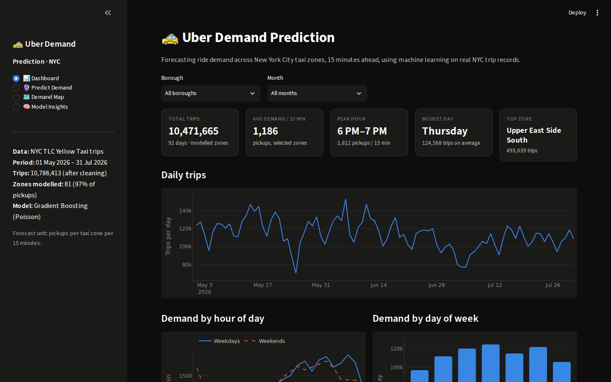
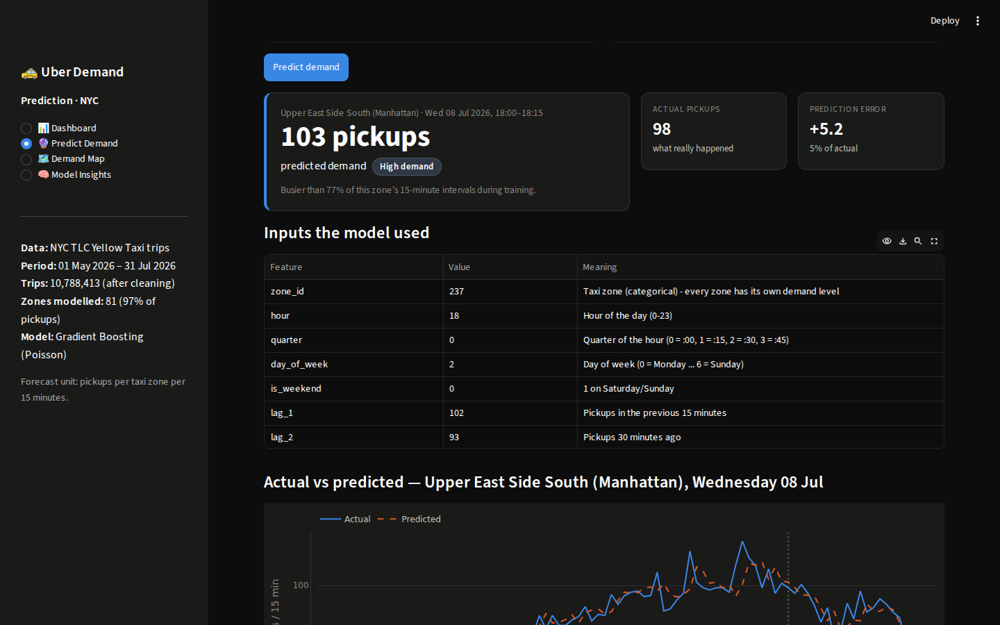
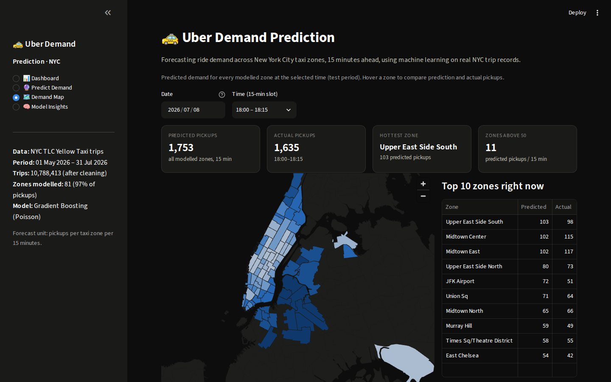

# 🚕 Uber Demand Prediction – NYC

Forecasts **how many ride pickups will happen in each New York City taxi zone in the next 15 minutes**, using machine learning on **10.8 million real NYC trips** (May–July 2026). Includes an interactive Streamlit app with a demand dashboard, live predictions, a city-wide demand map and a model-insights page.

> **Why it matters:** ride-hailing platforms use short-term demand forecasts to move drivers to where riders will be, which cuts waiting times and idle driving.



---

## ✨ Features

| Page | What it shows |
|---|---|
| 📊 **Dashboard** | Total trips, average demand, peak hour, busiest day and top zone · daily trend · demand by hour (weekday vs weekend) and by day · peak-demand heatmap · top zones · borough breakdown. Filter by borough and month. |
| 🔮 **Predict Demand** | **From real history:** pick a zone and time, and the model forecasts the next 15 minutes and compares it with what actually happened, plus the whole day's actual-vs-predicted curve. **What-if:** type your own recent demand values to see how the forecast reacts. |
| 🗺️ **Demand Map** | Every modelled zone coloured by predicted demand at a chosen time, with hover details and the top 10 zones. |
| 🧠 **Model Insights** | Algorithm and why it was chosen · metrics vs baselines · feature importance · historical vs predicted demand · error by hour · data-cleaning summary. |

| Prediction | Demand map |
|---|---|
|  |  |

---

## 📈 Results (test month: July 2026, never seen during training)

| Model | MAE ↓ | RMSE ↓ | R² ↑ | WAPE ↓ |
|---|---|---|---|---|
| Baseline – repeat last 15 min | 3.74 | 6.24 | 0.889 | 28.0% |
| Baseline – same time last week | 4.72 | 8.63 | 0.787 | 35.2% |
| Linear Regression | 3.23 | 5.36 | 0.918 | 24.1% |
| **Gradient Boosting (chosen)** | **3.02** | **5.07** | **0.927** | **22.6%** |

- **MAE** = average error in pickups per zone per 15 minutes. The chosen model is **19% more accurate than the naive baseline**.
- **WAPE** (total error ÷ total demand) is used instead of MAPE, because MAPE breaks down when a zone has 0–1 pickups.

---

## 🧠 How it works

### 1. Data
[NYC TLC Yellow Taxi Trip Records](https://www.nyc.gov/site/tlc/about/tlc-trip-record-data.page), May–July 2026 (11.5M trips), plus the official **taxi zone lookup table** (263 zones with names and boroughs) and **zone boundaries** (for the map).

### 2. Preprocessing – `src/data_processing.py`
- Keep only pickups inside each file's month (the raw files contain stray timestamps).
- Remove invalid records: unknown zones, distance outside 0.1–50 miles, fare outside $1–$250, duration outside 1–180 minutes (670K trips, 5.8%, removed).
- **Aggregate** trips into **pickups per zone per 15 minutes**, and fill intervals with no trips with 0.
- Model the **81 busiest zones, which cover 97% of all pickups**. The remaining zones are too sparse to forecast reliably.

### 3. Feature engineering – `src/features.py`
| Group | Features |
|---|---|
| Recent demand | `lag_1`…`lag_4` (last hour, in 15-min steps), `rolling_mean_1h`, `ewma` (exponentially weighted average) |
| Seasonality | `lag_1d` (same time yesterday), `lag_1w` (same time last week) |
| Time | `hour`, `quarter` (of the hour), `day_of_week`, `is_weekend` |
| Location | `zone_id` (categorical) |

Every feature uses only data from **before** the interval being predicted, so there's no data leakage. The same function builds features for training and for the app.

### 4. Model – `src/train.py`
- **HistGradientBoostingRegressor** (scikit-learn) with **Poisson loss**, which suits count data that is never negative.
  - Gradient boosting learns non-linear patterns, e.g. rush hour looks different in Midtown than at JFK.
  - It handles the zone as a native categorical feature and trains fast on ~420K rows.
- **Time-based split:** trained on May–June, tested on July. Splitting randomly would leak future information into training.
- Compared against two naive baselines and Linear Regression. Early stopping chose 623 trees.
- **Feature importance** is measured with permutation importance: how much the error grows when a feature is shuffled. Recent demand (`ewma`, `lag_1`) matters most, followed by zone and hour.

---

## 📁 Project structure

```
uber-demand-prediction/
├── app.py                   # Streamlit app (4 pages)
├── src/
│   ├── config.py            # paths and settings
│   ├── data_processing.py   # step 1: clean trips -> pickups per zone per 15 min
│   ├── zones.py             # zone centres + map boundaries from the official shapefile
│   ├── features.py          # step 2: feature engineering (shared by training and app)
│   ├── train.py             # step 3: train, evaluate, save model + metrics
│   ├── model.py             # prediction helper used by training and app
│   └── charts.py            # consistent chart styling
├── data/
│   ├── raw/                 # downloaded TLC files (not committed)
│   └── processed/           # demand table, zones, map boundaries, data summary
├── models/                  # trained model, metrics, feature importance, test predictions
├── assets/                  # screenshots
├── .streamlit/config.toml   # dark theme
└── requirements.txt
```

---

## 🚀 Run locally

```bash
git clone https://github.com/aakashcse/uber-demand-prediction.git
cd uber-demand-prediction
python -m venv venv
venv\Scripts\activate            # Windows  (Mac/Linux: source venv/bin/activate)
pip install -r requirements.txt
python -m streamlit run app.py
```
The processed data and trained model are included, so the app runs straight away.

### Rebuild everything from the raw data (optional)
1. From the [TLC page](https://www.nyc.gov/site/tlc/about/tlc-trip-record-data.page), download 3 months of **Yellow Taxi Trip Records** (parquet), the **Taxi Zone Lookup Table** and the **Taxi Zone Shapefile** into `data/raw/`.
2. Run:
```bash
pip install -r requirements-dev.txt
python -m src.data_processing     # ~5 s
python -m src.train               # ~40 s
```

---

## 🔭 Possible improvements
- Add weather and public holidays/events as features.
- Forecast several steps ahead (next 1–2 hours) instead of only the next 15 minutes.
- Use real Uber trips from the NYC High-Volume For-Hire Vehicle dataset.

## 👤 Author
**Aakash Kumar Singh** · [GitHub](https://github.com/aakashcse)

Data: NYC Taxi & Limousine Commission (TLC) Trip Record Data.
